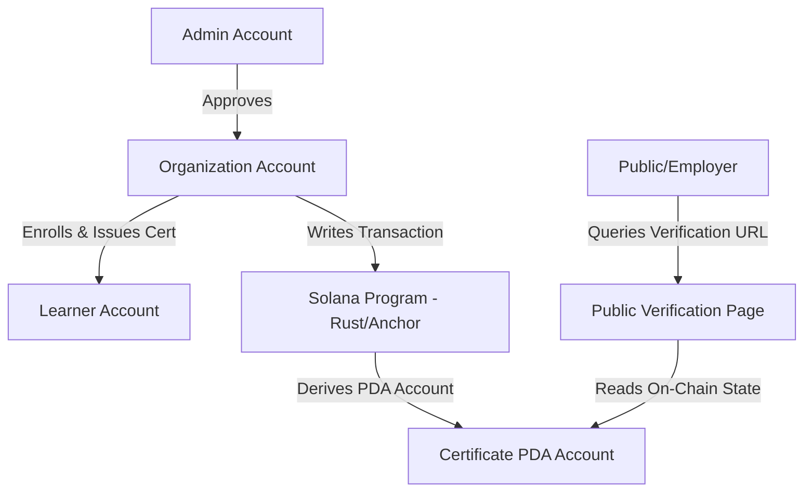

# VerifyCertify

VerifyCertify is a secure, blockchain-powered certificate issuance and verification platform built on the Solana network. It allows approved organizations to issue immutable digital certificates to learners, which can be verified globally on-chain by anyone without requiring a wallet or account.

## 🌟 Key Features

- **Decentralized Trust**: Certificates are written directly to the Solana blockchain as Program Derived Addresses (PDAs), making them immutable and tamper-proof.
- **Role-Based Dashboards**: Tailored views and controls for Admins, Organizations, and Learners.
- **Organization Onboarding**: Admin approval system prevents malicious entities from issuing counterfeit certificates.
- **Public Verification**: A custom, wallet-free public verification portal allows employers and clients to instantly verify validity using cryptographic on-chain data.
- **Modern Tech Stack**: Full-stack integration utilizing Next.js 15, React 19, MongoDB (Mongoose), Google OAuth, Jotai, TanStack Query, and Anchor.

---

## 🛠️ Tech Stack & Architecture



- **Frontend**: Next.js 15 (App Router), React 19, TypeScript, Tailwind CSS v4, Lucide React
- **Backend / API**: Next.js Server Components and API Routes
- **Database**: MongoDB (Mongoose schemas for users & course registry)
- **Smart Contract (Solana Program)**: Anchor/Rust (Program ID: `8Wsmf8Sb8hvTwRPNJL3VEaLS3gyWey27Lv1PcqmtqFkc`)
- **Authentication**: JWT Cookies + Google Sign-In (`google-auth-library`)

---

## 🚀 Getting Started

### Prerequisites

- Node.js (v18+)
- Rust & Solana CLI Tools (if compiling/deploying smart contracts)
- Anchor CLI (v0.30+)
- MongoDB connection string

### Installation

1. **Clone the repository and install dependencies:**
   ```shell
   pnpm install
   ```

2. **Set up Environment Variables:**
   Create a `.env.local` file in the root directory:
   ```env
   MONGODB_URI=your_mongodb_connection_string
   JWT_SECRET=your_jwt_secret
   GOOGLE_CLIENT_ID=your_google_oauth_client_id
   NEXT_PUBLIC_SOLANA_CLUSTER=devnet
   ```

3. **Start local development servers:**
   - Run the frontend:
     ```shell
     pnpm dev
     ```
   - Start the local Solana validator:
     ```shell
     pnpm anchor-localnet
     ```

---

## ⚓ Smart Contract (Anchor)

The Solana program is located under `anchor/programs/certify`.

### Key Commands

- **Build Program:**
  ```shell
  pnpm anchor-build
  ```

- **Run Tests:**
  ```shell
  pnpm anchor-test
  ```

- **Sync Program Keypair:**
  ```shell
  pnpm anchor keys sync
  ```

- **Deploy to Devnet:**
  ```shell
  pnpm anchor deploy --provider.cluster devnet
  ```

---

## 🔒 Verification Flow

A certificate is stored on Solana as a Program Derived Address (PDA) with seeds derived from:
`seeds = [learner_id.as_bytes(), course_name.as_bytes()]`

The public verification endpoint queries the Solana ledger directly to read and confirm:
1. **Issuer Public Key**: The authorized organization's signature.
2. **Issue Date**: Cryptographically recorded timestamp on-chain.
3. **Learner Info**: Name and ID matches.
4. **Course Details**: Certified course name.
